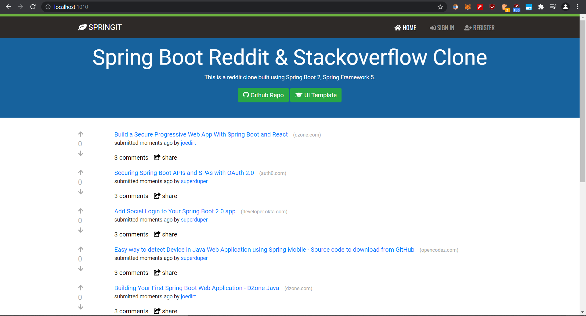
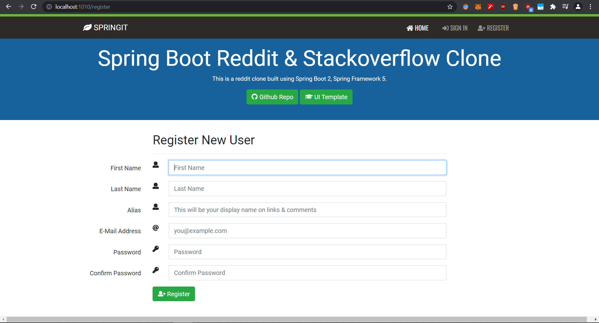
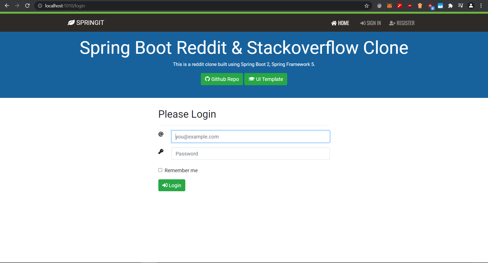
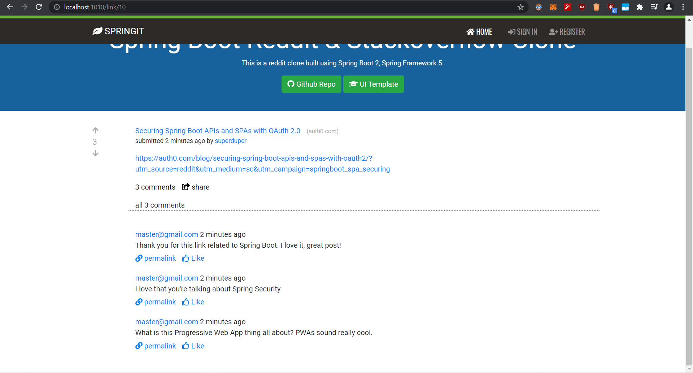
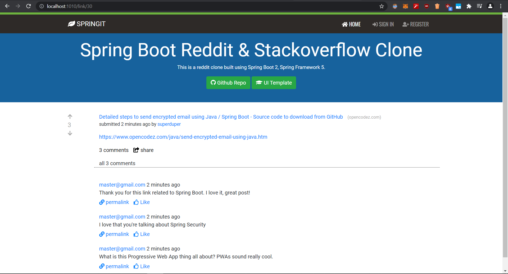

# Redit -Stackoverflow Clone

Ask-Answers is a fullstack Redit - Stackoverflow Clone . this project is useful for learning and experimenting with Spring 5 , Spring Boot ,Spring Security , Thymeleaf  and JPA.

The Application is implemented as a [Spring Boot](https://projects.spring.io/spring-boot/) app running an embedded version of Tomcat. the data storage is [H2 Database](https://www.h2database.com/) which is an in-memory database And 
[MySql](https://www.mysql.com/) Database accessed via [Spring JPA](https://projects.spring.io/spring-data-jpa/).

## Built With

* 	[Maven](https://maven.apache.org/) - Dependency Management
* 	[JDK 11](https://www.oracle.com/java/technologies/javase-jdk11-downloads.html) - Java™ Platform, Standard Edition Development Kit
* 	[Spring Boot](https://spring.io/projects/spring-boot) - Framework to ease the bootstrapping and development of new Spring Applications
* 	[Mysql](https://www.mysql.com/) - Open-Source Relational Database Management System
* 	[git](https://git-scm.com/) - Free and Open-Source distributed version control system
*   [Bootstrap](https://getbootstrap.com/) - front-end open source toolkit
*   [thymeleaf](http://thymeleaf.org/) - server-side Java template engine
*   [Spring Security](https://spring.io/projects/spring-security) -Spring Security is a powerful and highly customizable authentication and access-control framework
## External Tools Used

* [Postman](https://www.getpostman.com/) - API Development Environment (Testing Docmentation)

### UI Template 
[Front End Ui](https://github.com/danvega/springit-templates) - springit-templates
Spring Reddit Clone Layouts & Templates
# Database Configuration
Ask-Answer app  uses an in-memory database (H2) seeded with a commandLineRunner. The h2 console is automatically exposed at http://localhost:1010/h2-console and it is possible to inspect the content of the database using the jdbc:h2:mem:testdb url.

A similar setup is provided for Mysql in properties file in case a persistent database configuration is needed.

first you need to create a local database[Schema] called askanswer using mysql command Line.

```
create database askanswer;
```

## Deploying the application to OpenShift or AWS


To deploy the sample application to OpenShift you can use the [OpenShift CLI](https://docs.openshift.org/latest/cli_reference/index.html):

```shell
oc new-app codecentric/springboot-maven3-centos~https://github.com/Urodacus/ask-answer-app

```

This will create:

* An ImageStream called "springboot-maven3-centos"
* An ImageStream called "askanswerapp"
* A BuildConfig called "askanswerapp"
* DeploymentConfig called "askanswerapp"
* Service called "askanswerapp"

If you want to access the app from outside your OpenShift installation, you have to expose the askanswerapp service:

```shell
oc expose askanswerapp --hostname=www.example.com
```

#### To deploy the sample application to AWS or Container

you can check these links :
* [Deploying on AWS Using AWS Elastic Beanstalk](https://aws.amazon.com/blogs/devops/deploying-a-spring-boot-application-on-aws-using-aws-elastic-beanstalk/)
* [Deploying a Spring Boot Application - docs](https://docs.spring.io/spring-boot/docs/current/reference/html/deployment.html)


### maven

Build Spring Boot Project with Maven `mvn install / mvn clean install`

run spring boot using maven : `mvn spring-boot:run`

or load it into your ide then run it. 

access it via local host after configuring the port in properties file . 
``` 
 server.port = <<port number>>
```


# Contributions and Future improvements

#### In case you find a bug or have a suggested improvement
The [issue tracker](https://github.com/Urodacus/ask-answer-app/issues) is the preferred channel for bug reports, features requests and submitting pull requests.

## finished

- [x] RESTful Web Service
- [x] Bootstrap - CSS
- [x] Web - Thymeleaf, JavaScript
- [x] Spring Data JPA
- [x] H2 
- [x] Spring AOP
- [x] Spring boot Security
- [x] Authentication 
- [x] Actuator
- [x] MySql Configuration 

## sample screenshot of the completed app








### Contributions can be made by following these steps:

1. Fork it!
2. Create your feature branch: `git checkout -b my-new-feature`
3. Commit your changes: `git commit -am 'Add some feature'`
4. Push to the branch: `git push origin my-new-feature`
5. Submit a pull request
